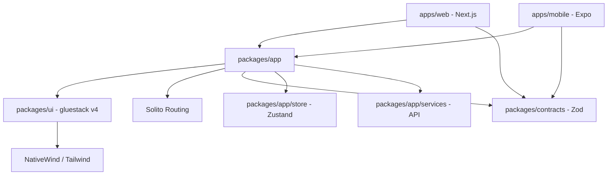

# 🚀 Nexpo Stack

[](https://nextjs.org/)
[](https://expo.dev/)
[](https://gluestack.io/)
[](https://solito.dev/)
[](https://www.nativewind.dev/)
[](https://turbo.build/)

**The ultimate Next.js 16 + Expo 55 monorepo starter.** Build high-performance, premium applications for **Web**, **iOS**, and **Android** with a single codebase. Powered by **gluestack-ui v4**, it provides a **Shadcn-compatible** developer experience with unified logic via **Solito** and **NativeWind**.

---

## 🌟 Why Nexpo Stack?

Nexpo Stack combines the power of **Next.js** for the web and **Expo** for mobile, unified by **Solito** routing and **gluestack-ui v4**.

- **Unified Logic**: One repository, one language, three platforms.
- **Modern UI**: Powered by **gluestack-ui v4**, offering a Shadcn-like developer experience—completely customizable, accessible, and unstyled primitives.
- **Native Performance**: Real native components on mobile, optimized SSR/Static generation on web.
- **Developer Velocity**: Hot-reloading across all platforms, type-safe contracts, and pre-built design systems.

---

## ⚡ Tech Stack & Cross-Platform Services

| Category              | Technology                               | Version  | Description                               |
| :-------------------- | :--------------------------------------- | :------- | :---------------------------------------- |
| **Web Framework**     | [Next.js](https://nextjs.org/)           | `16.2.4` | App Router, SEO optimized, Edge ready.    |
| **Mobile Framework**  | [Expo SDK](https://expo.dev/)            | `55.x`   | Native performance, easy deployments.     |
| **Universal Routing** | [Solito](https://solito.dev/)            | `5.x`    | Unified navigation for Web and Native.    |
| **UI Components**     | [gluestack-ui v4](https://gluestack.io/) | `4.1.x`  | Shadcn-compatible, accessible primitives. |
| **Styling**           | [NativeWind](https://nativewind.dev/)    | `v4`     | Tailwind CSS for React Native & Web.      |
| **Icons**             | [Lucide](https://lucide.dev/)            | `Latest` | Beautiful, consistent iconography.        |
| **Server State**      | [TanStack Query](https://tanstack.com/)  | `v5`     | Powerful data fetching & caching.         |
| **Client State**      | [Zustand](https://zustand-demo.pmnd.rs/) | `Latest` | Simple, scalable state management.        |
| **Validation**        | [Zod](https://zod.dev/)                  | `v3.24`  | Type-safe schema validation.              |
| **Skeleton Loading**  | [Boneyard JS](https://github.com/)       | `v1.7`   | Pixel-perfect skeleton screens.           |

---

## 🏗️ Architecture

Nexpo Stack uses a **Shared-First** monorepo architecture powered by Turborepo.



### Workspace Breakdown

- **`apps/web`**: Next.js App Router. Blazing fast, SEO-friendly web experience.
- **`apps/mobile`**: Expo / React Native. High-fidelity mobile experience with `expo-router`.
- **`packages/app`**: The core logic. Contains screens, business logic, and navigation providers.
- **`packages/ui`**: Shared design system built with gluestack-ui v4 (Shadcn-like components).
- **`packages/contracts`**: Centralized TypeScript interfaces and Zod schemas.
- **`packages/env`**: Unified environment variable management.

---

## 🚦 Quick Start

### 1. Prerequisites

- [Node.js](https://nodejs.org/) (v18+)
- [pnpm](https://pnpm.io/) (v10+)

### 2. Setup

```bash
# Clone and install
git clone <your-repo>
pnpm install

# Run all platforms
pnpm dev
```

### 3. Adding UI Components

Nexpo Stack uses the gluestack-ui v4 CLI. To add a new component:

```bash
cd packages/ui
pnpm add-ui <component-name>
```

---

## 🤝 Contributing

We love contributions! Whether it's fixing a bug, adding a feature, or improving documentation:

1. **Fork** the repository.
2. **Create** your feature branch: `git checkout -b feature/amazing-feature`.
3. **Commit** your changes: `git commit -m 'Add amazing feature'`.
4. **Push** to the branch: `git push origin feature/amazing-feature`.
5. **Open** a Pull Request.

---

## 📄 License

This project is open-source and available under the [MIT License](LICENSE).

---

**Built with ❤️ by the Nexpo Stack community.**
